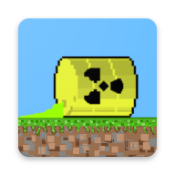

# DirtySystem 
Progetto di Game Design and Development anno accademico 2021/2022
## Authors

- Massimiliano Russo

## Description 
Dirty System è un gioco sviluppato in Android, che ha come trama il tema dell'inquinamento.
Lo scopo del giocatore è inquinare il terreno con barili tossici e rallentare la ruspa nel pulire il campo di gioco.
## Trailer Game
Premere per il trailer.

